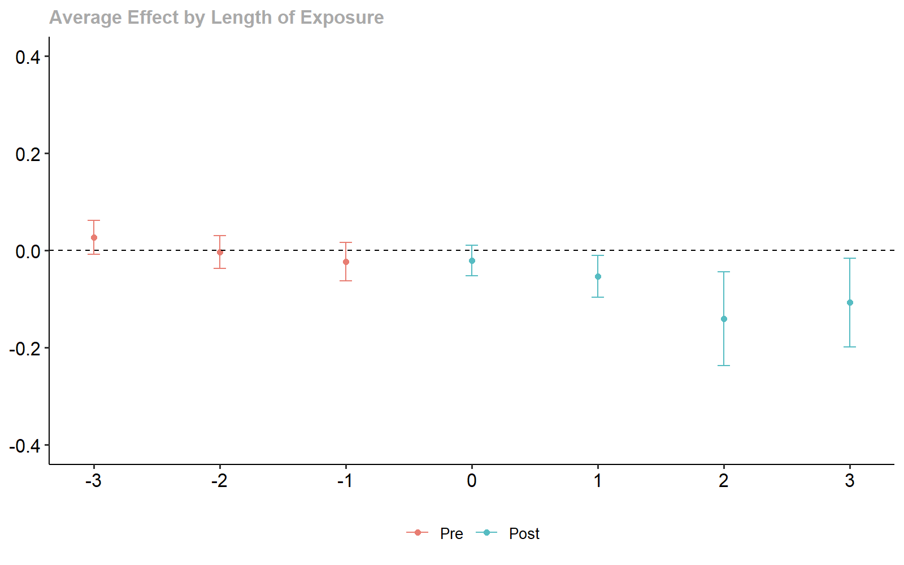

# Diff-in-Diff with Double/Debiased Machine Learning

## Introduction

This article illustrates how `ddml` can complement the highly popular
[`did`](https://bcallaway11.github.io/did/index.html) package to compute
group-time average treatment effects under a *conditional* parallel
trends assumption. The result is a doubly-robust
difference-in-difference estimator for staggered treatment adoption
designs that leverages machine learning and (short-)stacking to flexibly
control for covariates – or: difference-in-difference with machine
learning.

For an excellent introduction to differences-in-differences with
multiple time periods, see also [this
article](https://bcallaway11.github.io/did/articles/multi-period-did.html).
For a detailed discussion of the relevant asymptotic theory for
double/debiased machine learning difference-in-difference estimators see
Chang (2020).

## Estimation using `did`’s Default Estimator

For illustration, consider the data of Callaway and Sant’Anna (2020) on
county-level teen employment rates from 2003-2007 for additional
details. We are interested in the effect of treatment on the
log-employment rate `lemp` and assume that parallel trends holds
conditional on county population (`lpop` is the log of county
population).

``` r
# Load the did package
library(did)
set.seed(588239)

# Print the data
data(mpdta)
head(mpdta)
#>     year countyreal     lpop     lemp first.treat treat
#> 866 2003       8001 5.896761 8.461469        2007     1
#> 841 2004       8001 5.896761 8.336870        2007     1
#> 842 2005       8001 5.896761 8.340217        2007     1
#> 819 2006       8001 5.896761 8.378161        2007     1
#> 827 2007       8001 5.896761 8.487352        2007     1
#> 937 2003       8019 2.232377 4.997212        2007     1
```

By default, the group-time average treatment effect estimator of the
`did` package controls *linearly* for additional covariates. (In
particular, the propensity score is estimated using [logistic
regression](https://github.com/pedrohcgs/DRDID/blob/master/R/drdid_panel.R#L96)
and the outcome reduced form is estimated via [linear
regression](https://github.com/pedrohcgs/DRDID/blob/master/R/drdid_panel.R#L107)).
The below code snippet runs the default linear specification (similar to
[this
article](https://bcallaway11.github.io/did/articles/did-basics.html#an-example-with-real-data)).

``` r
# Estimate group-time average treatment effects with covariates
attgt_lm <- att_gt(yname = "lemp",
                   gname = "first.treat",
                   idname = "countyreal",
                   tname = "year",
                   xformla = ~lpop,
                   data = mpdta)

# summarize the results
summary(attgt_lm)
#> 
#> Call:
#> att_gt(yname = "lemp", tname = "year", idname = "countyreal", 
#>     gname = "first.treat", xformla = ~lpop, data = mpdta)
#> 
#> Reference: Callaway, Brantly and Pedro H.C. Sant'Anna.  "Difference-in-Differences with Multiple Time Periods." Journal of Econometrics, Vol. 225, No. 2, pp. 200-230, 2021. <https://doi.org/10.1016/j.jeconom.2020.12.001>, <https://arxiv.org/abs/1803.09015> 
#> 
#> Group-Time Average Treatment Effects:
#>  Group Time ATT(g,t) Std. Error [95% Simult.  Conf. Band]  
#>   2004 2004  -0.0145     0.0231       -0.0757      0.0467  
#>   2004 2005  -0.0764     0.0295       -0.1544      0.0016  
#>   2004 2006  -0.1404     0.0382       -0.2417     -0.0392 *
#>   2004 2007  -0.1069     0.0338       -0.1963     -0.0175 *
#>   2006 2004  -0.0005     0.0226       -0.0603      0.0593  
#>   2006 2005  -0.0062     0.0190       -0.0565      0.0441  
#>   2006 2006   0.0010     0.0199       -0.0518      0.0537  
#>   2006 2007  -0.0413     0.0207       -0.0962      0.0136  
#>   2007 2004   0.0267     0.0145       -0.0116      0.0651  
#>   2007 2005  -0.0046     0.0151       -0.0444      0.0353  
#>   2007 2006  -0.0284     0.0177       -0.0752      0.0183  
#>   2007 2007  -0.0288     0.0154       -0.0696      0.0121  
#> ---
#> Signif. codes: `*' confidence band does not cover 0
#> 
#> P-value for pre-test of parallel trends assumption:  0.23267
#> Control Group:  Never Treated,  Anticipation Periods:  0
#> Estimation Method:  Doubly Robust
```

The `did` package offers visualization methods using `gglpot2`:

``` r
ggdid(attgt_lm, ylim = c(-.4, .4))
```


Diff-in-Diff Estimates.

Further, the group-time average treatment effects can easily be
aggregated, for example, to estimate dynamic average treatment effects:

``` r
# aggregate the group-time average treatment effects
dyn_lm <- aggte(attgt_lm, type = "dynamic")
summary(dyn_lm)
#> 
#> Call:
#> aggte(MP = attgt_lm, type = "dynamic")
#> 
#> Reference: Callaway, Brantly and Pedro H.C. Sant'Anna.  "Difference-in-Differences with Multiple Time Periods." Journal of Econometrics, Vol. 225, No. 2, pp. 200-230, 2021. <https://doi.org/10.1016/j.jeconom.2020.12.001>, <https://arxiv.org/abs/1803.09015> 
#> 
#> 
#> Overall summary of ATT's based on event-study/dynamic aggregation:  
#>      ATT    Std. Error     [ 95%  Conf. Int.]  
#>  -0.0804        0.0195    -0.1187      -0.042 *
#> 
#> 
#> Dynamic Effects:
#>  Event time Estimate Std. Error [95% Simult.  Conf. Band]  
#>          -3   0.0267     0.0135       -0.0085      0.0619  
#>          -2  -0.0036     0.0130       -0.0373      0.0301  
#>          -1  -0.0232     0.0151       -0.0624      0.0160  
#>           0  -0.0211     0.0120       -0.0523      0.0102  
#>           1  -0.0530     0.0166       -0.0961     -0.0099 *
#>           2  -0.1404     0.0371       -0.2368     -0.0441 *
#>           3  -0.1069     0.0352       -0.1982     -0.0156 *
#> ---
#> Signif. codes: `*' confidence band does not cover 0
#> 
#> Control Group:  Never Treated,  Anticipation Periods:  0
#> Estimation Method:  Doubly Robust
ggdid(dyn_lm, ylim = c(-.4, .4))
```



Dynamic Treatment Effect Estimates.

## Contructing a `xgboost`-based Diff-in-Diff Estimator

Without additional *parametric* functional form assumptions on the
reduced form equations, it is *not* guaranteed that the default `att_gt`
estimator returns a convex combination of causal effects. This is
because linear predictors do not necessarily correspond to the
conditional expectation functions arising in the doubly-robust score of
the group-time average treatment effect. The resulting misspecification
error can then lead to negative weights in the aggregation of
individual-level treatment effects.

Fortunately, a convex combination of causal effects can be guaranteed
(without parametric functional form assumptions) when using machine
learning (nonparametric) reduced form estimators.

`ddml` facilitates the use of a large set of machine learning reduced
form estimators, including simultaneous considerations of multiple
estimators via (short-)stacking.

To use `ddml` estimators with the `did` package, we can make use of the
`est_method` argument of the `att_gt` function (see also
`?did::att_gt`). It is useful to construct this method in two steps:

1.  A simple wrapper for `ddml_att` that returns the objects needed by
    `att_gt`
2.  A second wrapper that hard-codes arguments passed to `ddml_att`

This two-step approach allows for cleaner code when considering multiple
ddml-based estimators (as we do in this article).

The below code-snippet constructs a simple estimation method following
step 1:

``` r
# load the ddml package
library(ddml)

# write a general wrapper for ddml_att
ddml_did_method <- function(y1, y0, D, covariates, ...) {
  # Compute difference in outcomes
  delta_y <- y1 - y0
  # Compute the ATT
  att_fit <- ddml_att(y = delta_y, D = D, X = covariates, ...)
  # Return results
  inf.func <- att_fit$psi_b + att_fit$att * att_fit$psi_a
  output <- list(ATT = att_fit$att, att.inf.func = inf.func)
  return(output)
}#DDML_DID_METHOD
```

A potentially suitable machine learning reduced form estimator is
gradient tree boosting (see also
[`?mdl_xgboost`](https://www.thomaswiemann.com/ddml/reference/mdl_xgboost.md)).
The below code snippet completes the second wrapper by hard-coding both
the learner and its arguments. Here, we consider 10-fold cross-fitting
with a gradient tree boosting estimator (`eta` is the learning rate, see
also
[`?mdl_xgboost`](https://www.thomaswiemann.com/ddml/reference/mdl_xgboost.md)).

``` r
my_did_xgboost <- function(y1, y0, D, covariates, ...) {
  # Hard-code learners
  learners = list(what = mdl_xgboost,
                  args = list(nround = 500,
                              params = list(eta = 0.05, max_depth = 3),
                              early_stopping_rounds = 1))
  learners_DX = learners

  # Call the general ddml_did method w/ additional hard-coded arguments
  ddml_did_method(y1, y0, D, covariates,
                  learners = learners,
                  learners_DX = learners_DX,
                  sample_folds = 10,
                  silent = TRUE)
}#MY_DID_XGBOOST
```

We can now use the reduced form estimator `my_did_xgboost` and pass it
via the `est_method` argument:

``` r
# estimate group-time average treatment effects with ddml
attgt_xgboost <- att_gt(yname = "lemp",
                        gname = "first.treat",
                        idname = "countyreal",
                        tname = "year",
                        xformla = ~lpop,
                        data = mpdta,
                        est_method = my_did_xgboost)
#> Warning in trim_propensity_scores(m_X, trim, ensemble_type): : 207 propensity
#> scores were trimmed.
#> Warning in trim_propensity_scores(m_X, trim, ensemble_type): : 220 propensity
#> scores were trimmed.
#> Warning in trim_propensity_scores(m_X, trim, ensemble_type): : 208 propensity
#> scores were trimmed.
#> Warning in trim_propensity_scores(m_X, trim, ensemble_type): : 202 propensity
#> scores were trimmed.
#> Warning in trim_propensity_scores(m_X, trim, ensemble_type): : 48 propensity
#> scores were trimmed.
#> Warning in trim_propensity_scores(m_X, trim, ensemble_type): : 44 propensity
#> scores were trimmed.
#> Warning in trim_propensity_scores(m_X, trim, ensemble_type): : 49 propensity
#> scores were trimmed.
#> Warning in trim_propensity_scores(m_X, trim, ensemble_type): : 48 propensity
#> scores were trimmed.

# summarize the results
summary(attgt_xgboost)
#> 
#> Call:
#> att_gt(yname = "lemp", tname = "year", idname = "countyreal", 
#>     gname = "first.treat", xformla = ~lpop, data = mpdta, est_method = my_did_xgboost)
#> 
#> Reference: Callaway, Brantly and Pedro H.C. Sant'Anna.  "Difference-in-Differences with Multiple Time Periods." Journal of Econometrics, Vol. 225, No. 2, pp. 200-230, 2021. <https://doi.org/10.1016/j.jeconom.2020.12.001>, <https://arxiv.org/abs/1803.09015> 
#> 
#> Group-Time Average Treatment Effects:
#>  Group Time ATT(g,t) Std. Error [95% Simult.  Conf. Band] 
#>   2004 2004   0.1412     0.1138       -0.1427      0.4251 
#>   2004 2005   0.1658     0.2354       -0.4213      0.7529 
#>   2004 2006  -0.1373     0.3049       -0.8979      0.6232 
#>   2004 2007  -0.1872     0.2251       -0.7486      0.3743 
#>   2006 2004   0.0018     0.0519       -0.1276      0.1312 
#>   2006 2005  -0.0162     0.0463       -0.1316      0.0993 
#>   2006 2006  -0.0031     0.0431       -0.1105      0.1043 
#>   2006 2007   0.0132     0.0661       -0.1517      0.1781 
#>   2007 2004  -0.0648     0.1000       -0.3142      0.1847 
#>   2007 2005   0.0458     0.0763       -0.1445      0.2362 
#>   2007 2006   0.0381     0.1430       -0.3184      0.3947 
#>   2007 2007  -0.0970     0.1165       -0.3876      0.1936 
#> ---
#> Signif. codes: `*' confidence band does not cover 0
#> 
#> P-value for pre-test of parallel trends assumption:  0.97672
#> Control Group:  Never Treated,  Anticipation Periods:  0

# plot the coefficients
ggdid(attgt_xgboost, ylim = c(-.4, .4))
```


xgboost-based Diff-in-Diff Estimates.

Of course, use of the `ddml`-based reduced form estimator still allows
us to leverage the various other methods of the `did` package, including
the construction (and visualization of) dynamic average treatment
effects:

``` r
# aggregate the group-time average treatment effects
dyn_xgboost <- aggte(attgt_xgboost, type = "dynamic")
summary(dyn_xgboost)
#> 
#> Call:
#> aggte(MP = attgt_xgboost, type = "dynamic")
#> 
#> Reference: Callaway, Brantly and Pedro H.C. Sant'Anna.  "Difference-in-Differences with Multiple Time Periods." Journal of Econometrics, Vol. 225, No. 2, pp. 200-230, 2021. <https://doi.org/10.1016/j.jeconom.2020.12.001>, <https://arxiv.org/abs/1803.09015> 
#> 
#> 
#> Overall summary of ATT's based on event-study/dynamic aggregation:  
#>      ATT    Std. Error     [ 95%  Conf. Int.] 
#>  -0.0782        0.1306    -0.3343      0.1779 
#> 
#> 
#> Dynamic Effects:
#>  Event time Estimate Std. Error [95% Simult.  Conf. Band] 
#>          -3  -0.0648     0.1032       -0.2931      0.1635 
#>          -2   0.0355     0.0620       -0.1016      0.1727 
#>          -1   0.0254     0.1065       -0.2101      0.2610 
#>           0  -0.0524     0.0841       -0.2384      0.1336 
#>           1   0.0641     0.0854       -0.1247      0.2528 
#>           2  -0.1373     0.3137       -0.8310      0.5564 
#>           3  -0.1872     0.2189       -0.6711      0.2968 
#> ---
#> Signif. codes: `*' confidence band does not cover 0
#> 
#> Control Group:  Never Treated,  Anticipation Periods:  0
ggdid(dyn_xgboost, ylim = c(-.4, .4))
```


xgboost-based Dynamic Treatment Effect Estimates.

The gradient tree boosting-based ATT estimate is only slightly different
from the ATT estimate using the linear estimator of the `did` package,
however, it is statistically insignificant.

Given these two coefficients, is there a good reason to choose one over
the other?

It is ex-ante difficult to trade-off the potential bias from
misspecification that the linear estimator suffers from with the
potential bias from estimation error that the gradient tree boosting
estimator may suffer from. `ddml` allows to resolve this conflict in a
data-driven manner by simultaneous consideration of multiple machine
learners via (short-)stacking. We turn to this in the next section.

## Contructing a Shortstacking-based Diff-in-Diff Estimator

Instead of considering just a single machine learner – that may or may
not be suitable for the given application – we can leverage
(short-)stacking and simultaneously consider multiple machine learners.
As in other settings, this substantially increases robustness to the
underlying structure of the data.

We construct a new wrapper for our `ddml_did_method` that hard-codes
different reduced form estimators:

- linear or logistic regression
- gradient tree boosting with more and less regularization
- random forests with more and less regularization

The reduced form estimators are then optimally combined via non-negative
least squares. Note that this specification also includes the linear
control specifications considered by the default `did` learner, ensuring
that machine learners are not spuriously selected. We leverage
shortstacking to reduce computational time (see also
`vignette("stacking")`).

``` r
my_did_stacking <- function(y1, y0, D, covariates, ...) {
  # Hard-code learners for outcome reduced-form
  learners = list(list(fun = ols),
                  list(fun = mdl_xgboost,
                       args = list(nround = 500,
                                   params = list(eta = 0.05, max_depth = 1),
                                   early_stopping_rounds = 1)),
                  list(fun = mdl_xgboost,
                       args = list(nround = 500,
                                   params = list(eta = 0.05, max_depth = 3),
                                   early_stopping_rounds = 1)),
                  list(fun = mdl_ranger,
                       args = list(num.trees = 1000,
                                   max.depth = 1)),
                  list(fun = mdl_ranger,
                       args = list(num.trees = 1000,
                                   max.depth = 20)))
  # Hard-code learners for treatment reduced-form
  learners_DX = list(list(fun = mdl_glm),
                  list(fun = mdl_xgboost,
                       args = list(nround = 500,
                                   params = list(eta = 0.05, max_depth = 1),
                                   early_stopping_rounds = 1)),
                  list(fun = mdl_xgboost,
                       args = list(nround = 500,
                                   params = list(eta = 0.05, max_depth = 3),
                                   early_stopping_rounds = 1)),
                  list(fun = mdl_ranger,
                       args = list(num.trees = 1000,
                                   max.depth = 1)),
                  list(fun = mdl_ranger,
                       args = list(num.trees = 1000,
                                   max.depth = 20)))
  # Call the general ddml_did method w/ additional hard-coded arguments
  ddml_did_method(y1, y0, D, covariates,
                  learners = learners,
                  learners_DX = learners_DX,
                  sample_folds = 10,
                  ensemble_type = "nnls",
                  shortstack = TRUE,
                  silent = TRUE)
}#MY_DID_STACKING
```

Finally, we recompute the group-time average treatment effects using our
shortstacking estimator:

``` r
# estimate group-time average treatment effects with ddml
attgt_stacking <- att_gt(yname = "lemp",
                         gname = "first.treat",
                         idname = "countyreal",
                         tname = "year",
                         xformla = ~lpop ,
                         data = mpdta,
                         est_method = my_did_stacking)
#> Warning in trim_propensity_scores(m_X, trim, ensemble_type): 2 propensity
#> scores were trimmed.
#> Warning in trim_propensity_scores(m_X, trim, ensemble_type): 1 propensity
#> scores were trimmed.
#> Warning in trim_propensity_scores(m_X, trim, ensemble_type): 2 propensity
#> scores were trimmed.
#> Warning in trim_propensity_scores(m_X, trim, ensemble_type): 2 propensity
#> scores were trimmed.

# summarize the results
summary(attgt_stacking)
#> 
#> Call:
#> att_gt(yname = "lemp", tname = "year", idname = "countyreal", 
#>     gname = "first.treat", xformla = ~lpop, data = mpdta, est_method = my_did_stacking)
#> 
#> Reference: Callaway, Brantly and Pedro H.C. Sant'Anna.  "Difference-in-Differences with Multiple Time Periods." Journal of Econometrics, Vol. 225, No. 2, pp. 200-230, 2021. <https://doi.org/10.1016/j.jeconom.2020.12.001>, <https://arxiv.org/abs/1803.09015> 
#> 
#> Group-Time Average Treatment Effects:
#>  Group Time ATT(g,t) Std. Error [95% Simult.  Conf. Band]  
#>   2004 2004  -0.0143     0.0224       -0.0748      0.0461  
#>   2004 2005  -0.0761     0.0296       -0.1558      0.0036  
#>   2004 2006  -0.1372     0.0371       -0.2370     -0.0374 *
#>   2004 2007  -0.1062     0.0318       -0.1918     -0.0205 *
#>   2006 2004  -0.0020     0.0214       -0.0595      0.0554  
#>   2006 2005  -0.0061     0.0199       -0.0596      0.0475  
#>   2006 2006   0.0016     0.0184       -0.0478      0.0510  
#>   2006 2007  -0.0432     0.0203       -0.0978      0.0113  
#>   2007 2004   0.0263     0.0145       -0.0127      0.0653  
#>   2007 2005  -0.0036     0.0162       -0.0474      0.0401  
#>   2007 2006  -0.0276     0.0193       -0.0794      0.0243  
#>   2007 2007  -0.0275     0.0173       -0.0740      0.0189  
#> ---
#> Signif. codes: `*' confidence band does not cover 0
#> 
#> P-value for pre-test of parallel trends assumption:  0.24863
#> Control Group:  Never Treated,  Anticipation Periods:  0

# plot the coefficients
ggdid(attgt_stacking, ylim = c(-.4, .4))
```


Stacking-based Diff-in-Diff Estimates.

The results are largely similar to those of the default linear estimator
of the `did` package, suggesting that the linear approximation of the
reduced forms is sufficiently accurate. (Of course we didn’t know that
before – now, at least, we can sleep easy!)

Other settings, in particular settings with multiple control variables,
may show starker difference in the final estimates.

``` r
# aggregate the group-time average treatment effects
dyn_stacking <- aggte(attgt_stacking, type = "dynamic")
summary(dyn_stacking)
#> 
#> Call:
#> aggte(MP = attgt_stacking, type = "dynamic")
#> 
#> Reference: Callaway, Brantly and Pedro H.C. Sant'Anna.  "Difference-in-Differences with Multiple Time Periods." Journal of Econometrics, Vol. 225, No. 2, pp. 200-230, 2021. <https://doi.org/10.1016/j.jeconom.2020.12.001>, <https://arxiv.org/abs/1803.09015> 
#> 
#> 
#> Overall summary of ATT's based on event-study/dynamic aggregation:  
#>      ATT    Std. Error     [ 95%  Conf. Int.]  
#>  -0.0794        0.0202    -0.1189     -0.0399 *
#> 
#> 
#> Dynamic Effects:
#>  Event time Estimate Std. Error [95% Simult.  Conf. Band]  
#>          -3   0.0263     0.0144       -0.0111      0.0638  
#>          -2  -0.0033     0.0132       -0.0375      0.0310  
#>          -1  -0.0225     0.0148       -0.0611      0.0160  
#>           0  -0.0200     0.0110       -0.0487      0.0086  
#>           1  -0.0542     0.0164       -0.0969     -0.0114 *
#>           2  -0.1372     0.0402       -0.2419     -0.0325 *
#>           3  -0.1062     0.0341       -0.1949     -0.0175 *
#> ---
#> Signif. codes: `*' confidence band does not cover 0
#> 
#> Control Group:  Never Treated,  Anticipation Periods:  0
ggdid(dyn_stacking, ylim = c(-.4, .4))
```


Stacking-based Dynamic Treatment Effect Estimates.

## References

Callaway B, Sant’Anna P (2021). “Difference-in-differences with multiple
time periods.” Journal of Econometrics, 200-230.

Callaway B, Sant’Anna P (2021). “did: Difference in Differences.” R
package version 2.1.2, <https://bcallaway11.github.io/did/>.

Chang NC (2020). “Double/debiased machine learning for
difference-in-difference models.” The Econometrics Journal, 177-191.
