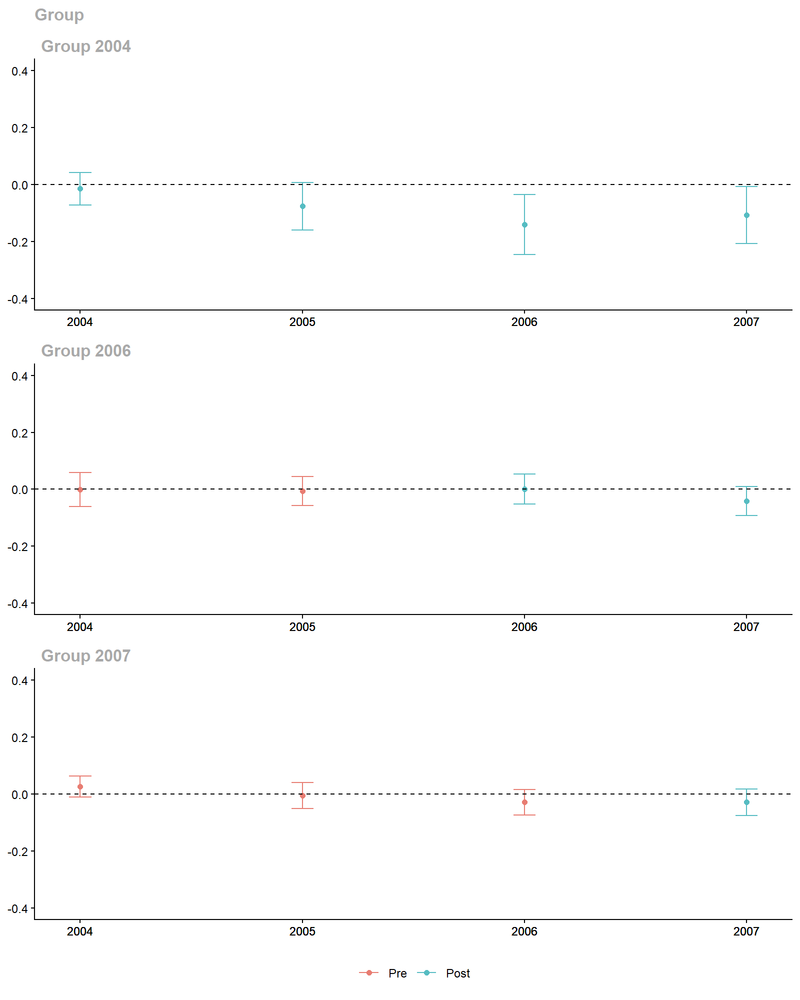
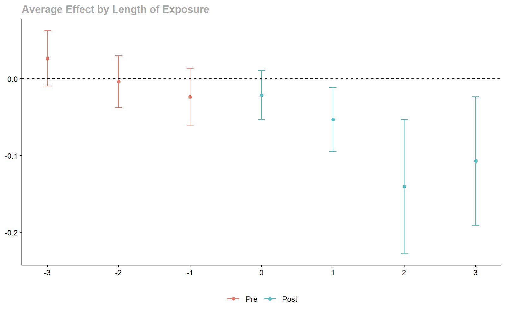
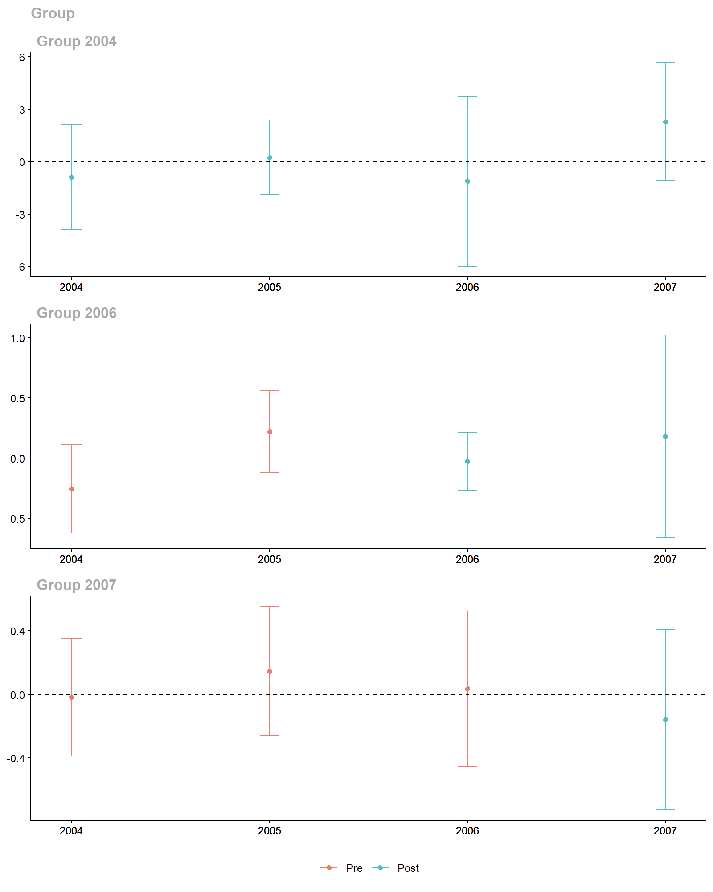
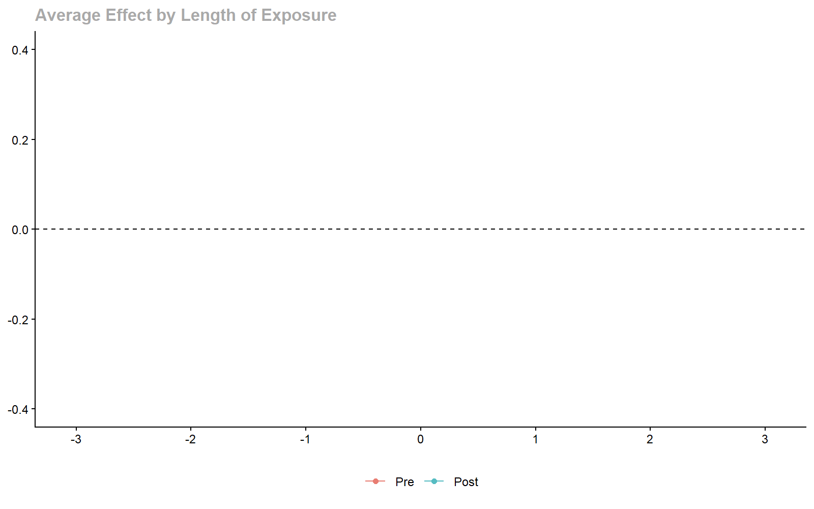
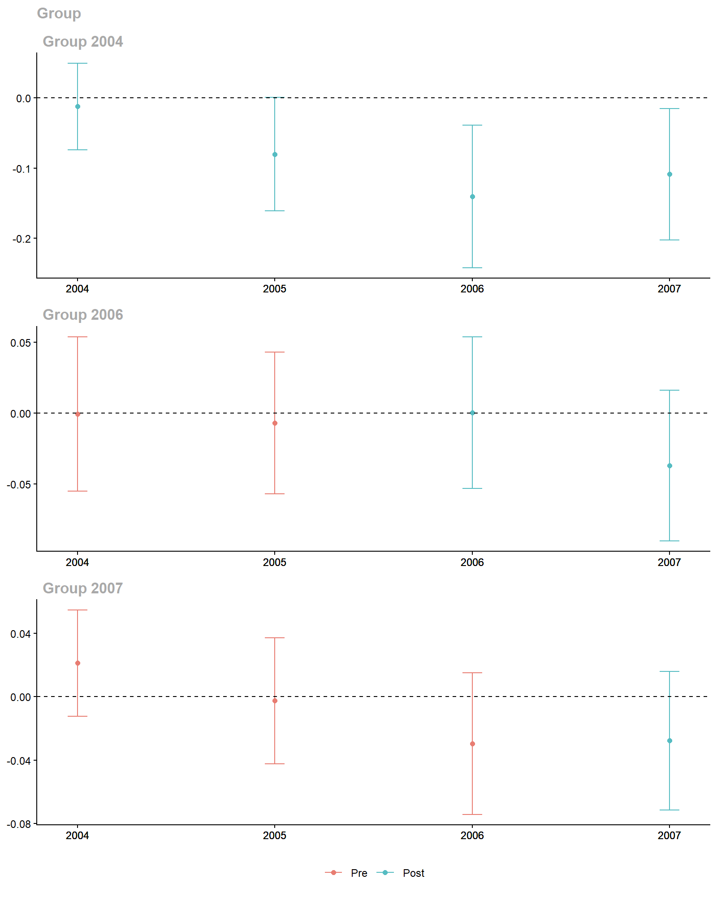
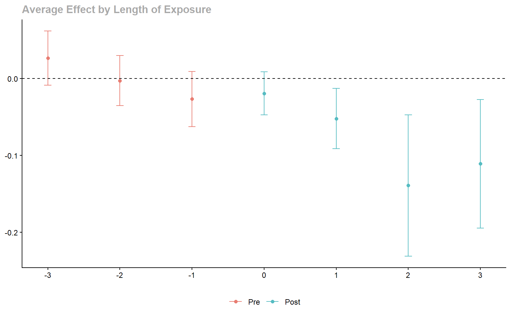

# Introduction

This article illustrates how ``ddml`` can complement the highly popular [``did``](https://bcallaway11.github.io/did/index.html) package to compute group-time average treatment effects under a _conditional_ parallel trends assumption. The result is a doubly-robust difference-in-difference estimator for staggered treatment adoption designs that leverages machine learning and (short-)stacking to flexibly control for covariates -- or: difference-in-difference with machine learning.

For an excellent introduction to differences-in-differences with multiple time periods, see also [this article](https://bcallaway11.github.io/did/articles/multi-period-did.html). For a detailed discussion of the relevant asymptotic theory for double/debiased machine learning difference-in-difference estimators see Chang (2020).

# Estimation using ``did``'s Default Estimator

For illustration, consider the data of Callaway and Sant'Anna (2020) on county-level teen employment rates from 2003-2007 for additional details. We are interested in the effect of treatment on the log-employment rate ``lemp`` and assume that parallel trends holds conditional on county population (``lpop`` is the log of county population).


```r
# Load the did package
library(did)
set.seed(588239)

# Print the data
data(mpdta)
head(mpdta)
#>     year countyreal     lpop     lemp first.treat treat
#> 866 2003       8001 5.896761 8.461469        2007     1
#> 841 2004       8001 5.896761 8.336870        2007     1
#> 842 2005       8001 5.896761 8.340217        2007     1
#> 819 2006       8001 5.896761 8.378161        2007     1
#> 827 2007       8001 5.896761 8.487352        2007     1
#> 937 2003       8019 2.232377 4.997212        2007     1
```

By default, the group-time average treatment effect estimator of the ``did`` package controls _linearly_ for additional covariates. (In particular, the propensity score is estimated using [logistic regression](https://github.com/pedrohcgs/DRDID/blob/master/R/drdid_panel.R#L96) and the outcome reduced form is estimated via  [linear regression](https://github.com/pedrohcgs/DRDID/blob/master/R/drdid_panel.R#L107)). The below code snippet runs the default linear specification (similar to [this article](https://bcallaway11.github.io/did/articles/did-basics.html#an-example-with-real-data)).


```r
# Estimate group-time average treatment effects with covariates
attgt_lm <- att_gt(yname = "lemp",
                   gname = "first.treat",
                   idname = "countyreal",
                   tname = "year",
                   xformla = ~lpop,
                   data = mpdta)

# summarize the results
summary(attgt_lm)
#> 
#> Call:
#> att_gt(yname = "lemp", tname = "year", idname = "countyreal", 
#>     gname = "first.treat", xformla = ~lpop, data = mpdta)
#> 
#> Reference: Callaway, Brantly and Pedro H.C. Sant'Anna.  "Difference-in-Differences with Multiple Time Periods." Journal of Econometrics, Vol. 225, No. 2, pp. 200-230, 2021. <https://doi.org/10.1016/j.jeconom.2020.12.001>, <https://arxiv.org/abs/1803.09015> 
#> 
#> Group-Time Average Treatment Effects:
#>  Group Time ATT(g,t) Std. Error [95% Simult.  Conf. Band]  
#>   2004 2004  -0.0145     0.0214       -0.0718      0.0427  
#>   2004 2005  -0.0764     0.0313       -0.1601      0.0072  
#>   2004 2006  -0.1404     0.0397       -0.2465     -0.0344 *
#>   2004 2007  -0.1069     0.0373       -0.2065     -0.0073 *
#>   2006 2004  -0.0005     0.0223       -0.0599      0.0590  
#>   2006 2005  -0.0062     0.0192       -0.0574      0.0450  
#>   2006 2006   0.0010     0.0199       -0.0523      0.0542  
#>   2006 2007  -0.0413     0.0191       -0.0924      0.0098  
#>   2007 2004   0.0267     0.0136       -0.0096      0.0630  
#>   2007 2005  -0.0046     0.0171       -0.0503      0.0411  
#>   2007 2006  -0.0284     0.0169       -0.0735      0.0166  
#>   2007 2007  -0.0288     0.0173       -0.0749      0.0174  
#> ---
#> Signif. codes: `*' confidence band does not cover 0
#> 
#> P-value for pre-test of parallel trends assumption:  0.23267
#> Control Group:  Never Treated,  Anticipation Periods:  0
#> Estimation Method:  Doubly Robust
```

The ``did`` package offers visualization methods using ``gglpot2``:


```r
ggdid(attgt_lm, ylim = c(-.4, .4))
```

<div class="figure" style="text-align: center">

<p class="caption">Diff-in-Diff Estimates.</p>
</div>

Further, the group-time average treatment effects can easily be aggregated, for example, to estimate dynamic average treatment effects:


```r
# aggregate the group-time average treatment effects
dyn_lm <- aggte(attgt_lm, type = "dynamic")
summary(dyn_lm)
#> 
#> Call:
#> aggte(MP = attgt_lm, type = "dynamic")
#> 
#> Reference: Callaway, Brantly and Pedro H.C. Sant'Anna.  "Difference-in-Differences with Multiple Time Periods." Journal of Econometrics, Vol. 225, No. 2, pp. 200-230, 2021. <https://doi.org/10.1016/j.jeconom.2020.12.001>, <https://arxiv.org/abs/1803.09015> 
#> 
#> 
#> Overall summary of ATT's based on event-study/dynamic aggregation:  
#>      ATT    Std. Error     [ 95%  Conf. Int.]  
#>  -0.0804        0.0196    -0.1188     -0.0419 *
#> 
#> 
#> Dynamic Effects:
#>  Event time Estimate Std. Error [95% Simult.  Conf. Band]  
#>          -3   0.0267     0.0143       -0.0092      0.0627  
#>          -2  -0.0036     0.0134       -0.0373      0.0301  
#>          -1  -0.0232     0.0147       -0.0603      0.0138  
#>           0  -0.0211     0.0127       -0.0529      0.0108  
#>           1  -0.0530     0.0165       -0.0946     -0.0114 *
#>           2  -0.1404     0.0349       -0.2281     -0.0528 *
#>           3  -0.1069     0.0333       -0.1907     -0.0231 *
#> ---
#> Signif. codes: `*' confidence band does not cover 0
#> 
#> Control Group:  Never Treated,  Anticipation Periods:  0
#> Estimation Method:  Doubly Robust
ggdid(dyn_lm, ylim = c(-.4, .4))
```

<div class="figure" style="text-align: center">

<p class="caption">Dynamic Treatment Effect Estimates.</p>
</div>

# Contructing a ``xgboost``-based Diff-in-Diff Estimator

Without additional _parametric_ functional form assumptions on the reduced form equations, it is _not_ guaranteed that the default ``att_gt`` estimator returns a convex combination of causal effects. This is because linear predictors do not necessarily correspond to the conditional expectation functions arising in the doubly-robust score of the group-time average treatment effect. The resulting misspecification error can then lead to negative weights in the aggregation of individual-level treatment effects.

Fortunately, a convex combination of causal effects can be guaranteed (without parametric functional form assumptions) when using machine learning (nonparametric) reduced form estimators.

``ddml`` facilitates the use of a large set of machine learning reduced form estimators, including simultaneous considerations of multiple estimators via (short-)stacking.

To use ``ddml`` estimators with the ``did`` package, we can make use of the ``est_method`` argument of the ``att_gt`` function (see also ``?did::att_gt``). It is useful to construct this method in two steps:

1. A simple wrapper for ``ddml_att`` that returns the objects needed by ``att_gt``
2. A second wrapper that hard-codes arguments passed to ``ddml_att``

This two-step approach allows for cleaner code when considering multiple ddml-based estimators (as we do in this article).

The below code-snippet constructs a simple estimation method following step 1:

```r
# load the ddml package
library(ddml)

# write a general wrapper for ddml_att
ddml_did_method <- function(y1, y0, D, covariates, ...) {
  # Compute difference in outcomes
  delta_y <- y1 - y0
  # Compute the ATT
  att_fit <- ddml_att(y = delta_y, D = D, X = covariates, ...)
  # Return results
  inf.func <- att_fit$psi_b + att_fit$att * att_fit$psi_a
  output <- list(ATT = att_fit$att, att.inf.func = inf.func)
  return(output)
}#DDML_DID_METHOD
```

A potentially suitable machine learning reduced form estimator is gradient tree boosting (see also ``?mdl_xgboost``). The below code snippet completes the second wrapper by hard-coding both the learner and its arguments. Here, we consider 10-fold cross-fitting with a gradient tree boosting estimator (``eta`` is the learning rate, see also ``?mdl_xgboost``).


```r
my_did_xgboost <- function(y1, y0, D, covariates, ...) {
  # Hard-code learners
  learners = list(what = mdl_xgboost,
                  args = list(nround = 500,
                              params = list(eta = 0.05, max_depth = 3),
                              early_stopping_rounds = 1))
  learners_DX = learners

  # Call the general ddml_did method w/ additional hard-coded arguments
  ddml_did_method(y1, y0, D, covariates,
                  learners = learners,
                  learners_DX = learners_DX,
                  sample_folds = 10,
                  silent = TRUE)
}#MY_DID_XGBOOST
```

We can now use the reduced form estimator ``my_did_xgboost`` and pass it via the ``est_method`` argument:


```r
# estimate group-time average treatment effects with ddml
attgt_xgboost <- att_gt(yname = "lemp",
                        gname = "first.treat",
                        idname = "countyreal",
                        tname = "year",
                        xformla = ~lpop,
                        data = mpdta,
                        est_method = my_did_xgboost)

# summarize the results
summary(attgt_xgboost)
#> 
#> Call:
#> att_gt(yname = "lemp", tname = "year", idname = "countyreal", 
#>     gname = "first.treat", xformla = ~lpop, data = mpdta, est_method = my_did_xgboost)
#> 
#> Reference: Callaway, Brantly and Pedro H.C. Sant'Anna.  "Difference-in-Differences with Multiple Time Periods." Journal of Econometrics, Vol. 225, No. 2, pp. 200-230, 2021. <https://doi.org/10.1016/j.jeconom.2020.12.001>, <https://arxiv.org/abs/1803.09015> 
#> 
#> Group-Time Average Treatment Effects:
#>  Group Time ATT(g,t) Std. Error [95% Simult.  Conf. Band] 
#>   2004 2004  -3.1503     7.2324      -20.7101     14.4095 
#>   2004 2005  -9.3142    11.6485      -37.5962     18.9677 
#>   2004 2006  -2.4850    11.1398      -29.5317     24.5617 
#>   2004 2007  17.8616    13.8177      -15.6868     51.4101 
#>   2006 2004  12.5594     6.1206       -2.3011     27.4200 
#>   2006 2005   6.0290     3.8927       -3.4222     15.4802 
#>   2006 2006  -1.1808     3.7726      -10.3405      7.9789 
#>   2006 2007  -4.7042    10.0708      -29.1554     19.7469 
#>   2007 2004  -2.8007    14.3252      -37.5814     31.9799 
#>   2007 2005   6.4227    16.4851      -33.6021     46.4476 
#>   2007 2006   2.6596    17.5628      -39.9817     45.3009 
#>   2007 2007 -15.0061    20.3873      -64.5052     34.4929 
#> ---
#> Signif. codes: `*' confidence band does not cover 0
#> 
#> P-value for pre-test of parallel trends assumption:  0.46872
#> Control Group:  Never Treated,  Anticipation Periods:  0

# plot the coefficients
ggdid(attgt_xgboost, ylim = c(-.4, .4))
```

<div class="figure" style="text-align: center">

<p class="caption">xgboost-based Diff-in-Diff Estimates.</p>
</div>

Of course, use of the ``ddml``-based reduced form estimator still allows us to leverage the various other methods of the ``did`` package, including the construction (and visualization of) dynamic average treatment effects:


```r
# aggregate the group-time average treatment effects
dyn_xgboost <- aggte(attgt_xgboost, type = "dynamic")
summary(dyn_xgboost)
#> 
#> Call:
#> aggte(MP = attgt_xgboost, type = "dynamic")
#> 
#> Reference: Callaway, Brantly and Pedro H.C. Sant'Anna.  "Difference-in-Differences with Multiple Time Periods." Journal of Econometrics, Vol. 225, No. 2, pp. 200-230, 2021. <https://doi.org/10.1016/j.jeconom.2020.12.001>, <https://arxiv.org/abs/1803.09015> 
#> 
#> 
#> Overall summary of ATT's based on event-study/dynamic aggregation:  
#>      ATT    Std. Error     [ 95%  Conf. Int.] 
#>  -0.4334        6.6254    -13.419     12.5522 
#> 
#> 
#> Dynamic Effects:
#>  Event time Estimate Std. Error [95% Simult.  Conf. Band] 
#>          -3  -2.8007    14.6781      -34.8946     29.2931 
#>          -2   7.8582    12.8711      -20.2846     36.0011 
#>          -1   3.4478    13.6719      -26.4462     33.3417 
#>           0 -10.8693    15.3861      -44.5113     22.7726 
#>           1  -6.2409     8.0050      -23.7441     11.2623 
#>           2  -2.4850    11.2198      -27.0174     22.0474 
#>           3  17.8616    12.8811      -10.3031     46.0263 
#> ---
#> Signif. codes: `*' confidence band does not cover 0
#> 
#> Control Group:  Never Treated,  Anticipation Periods:  0
ggdid(dyn_xgboost, ylim = c(-.4, .4))
```

<div class="figure" style="text-align: center">

<p class="caption">xgboost-based Dynamic Treatment Effect Estimates.</p>
</div>

The gradient tree boosting-based ATT estimate is only slightly different from the ATT estimate using the linear estimator of the ``did`` package, however, it is statistically insignificant.

Given these two coefficients, is there a good reason to choose one over the other?

It is ex-ante difficult to trade-off the potential bias from misspecification that the linear estimator suffers from with the potential bias from estimation error that the gradient tree boosting estimator may suffer from. ``ddml`` allows to resolve this conflict in a data-driven manner by simultaneous consideration of multiple machine learners via (short-)stacking. We turn to this in the next section.

# Contructing a Shortstacking-based Diff-in-Diff Estimator

Instead of considering just a single machine learner -- that may or may not be suitable for the given application -- we can leverage (short-)stacking and simultaneously consider multiple machine learners. As in other settings, this substantially increases robustness to the underlying structure of the data.

We construct a new wrapper for our ``ddml_did_method`` that hard-codes different reduced form estimators:

- linear or logistic regression
- gradient tree boosting with more and less regularization
- random forests with more and less regularization

The reduced form estimators are then optimally combined via non-negative least squares. Note that this specification also includes the linear control specifications considered by the default ``did`` learner, ensuring that machine learners are not spuriously selected. We leverage shortstacking to reduce computational time (see also `vignette("stacking")`).


```r
my_did_stacking <- function(y1, y0, D, covariates, ...) {
  # Hard-code learners for outcome reduced-form
  learners = list(list(fun = ols),
                  list(fun = mdl_xgboost,
                       args = list(nround = 500,
                                   params = list(eta = 0.05, max_depth = 1),
                                   early_stopping_rounds = 1)),
                  list(fun = mdl_xgboost,
                       args = list(nround = 500,
                                   params = list(eta = 0.05, max_depth = 3),
                                   early_stopping_rounds = 1)),
                  list(fun = mdl_ranger,
                       args = list(num.trees = 1000,
                                   max.depth = 1)),
                  list(fun = mdl_ranger,
                       args = list(num.trees = 1000,
                                   max.depth = 20)))
  # Hard-code learners for treatment reduced-form
  learners_DX = list(list(fun = mdl_glm),
                  list(fun = mdl_xgboost,
                       args = list(nround = 500,
                                   params = list(eta = 0.05, max_depth = 1),
                                   early_stopping_rounds = 1)),
                  list(fun = mdl_xgboost,
                       args = list(nround = 500,
                                   params = list(eta = 0.05, max_depth = 3),
                                   early_stopping_rounds = 1)),
                  list(fun = mdl_ranger,
                       args = list(num.trees = 1000,
                                   max.depth = 1)),
                  list(fun = mdl_ranger,
                       args = list(num.trees = 1000,
                                   max.depth = 20)))
  # Call the general ddml_did method w/ additional hard-coded arguments
  ddml_did_method(y1, y0, D, covariates,
                  learners = learners,
                  learners_DX = learners_DX,
                  sample_folds = 10,
                  ensemble_type = "nnls",
                  shortstack = TRUE,
                  silent = TRUE)
}#MY_DID_STACKING
```

Finally, we recompute the group-time average treatment effects using our shortstacking estimator:


```r
# estimate group-time average treatment effects with ddml
attgt_stacking <- att_gt(yname = "lemp",
                         gname = "first.treat",
                         idname = "countyreal",
                         tname = "year",
                         xformla = ~lpop ,
                         data = mpdta,
                         est_method = my_did_stacking)

# summarize the results
summary(attgt_stacking)
#> 
#> Call:
#> att_gt(yname = "lemp", tname = "year", idname = "countyreal", 
#>     gname = "first.treat", xformla = ~lpop, data = mpdta, est_method = my_did_stacking)
#> 
#> Reference: Callaway, Brantly and Pedro H.C. Sant'Anna.  "Difference-in-Differences with Multiple Time Periods." Journal of Econometrics, Vol. 225, No. 2, pp. 200-230, 2021. <https://doi.org/10.1016/j.jeconom.2020.12.001>, <https://arxiv.org/abs/1803.09015> 
#> 
#> Group-Time Average Treatment Effects:
#>  Group Time ATT(g,t) Std. Error [95% Simult.  Conf. Band]  
#>   2004 2004  -0.0110     0.0228       -0.0718      0.0498  
#>   2004 2005  -0.0761     0.0311       -0.1588      0.0066  
#>   2004 2006  -0.1408     0.0400       -0.2473     -0.0343 *
#>   2004 2007  -0.1051     0.0350       -0.1982     -0.0120 *
#>   2006 2004  -0.0040     0.0219       -0.0624      0.0544  
#>   2006 2005  -0.0067     0.0194       -0.0584      0.0449  
#>   2006 2006  -0.0010     0.0196       -0.0532      0.0512  
#>   2006 2007  -0.0409     0.0197       -0.0934      0.0115  
#>   2007 2004   0.0234     0.0141       -0.0141      0.0609  
#>   2007 2005  -0.0026     0.0159       -0.0450      0.0398  
#>   2007 2006  -0.0299     0.0178       -0.0772      0.0175  
#>   2007 2007  -0.0285     0.0166       -0.0728      0.0158  
#> ---
#> Signif. codes: `*' confidence band does not cover 0
#> 
#> P-value for pre-test of parallel trends assumption:  0.27165
#> Control Group:  Never Treated,  Anticipation Periods:  0

# plot the coefficients
ggdid(attgt_stacking, ylim = c(-.4, .4))
```

<div class="figure" style="text-align: center">

<p class="caption">Stacking-based Diff-in-Diff Estimates.</p>
</div>
The results are largely similar to those of the default linear estimator of the ``did`` package, suggesting that the linear approximation of the reduced forms is sufficiently accurate. (Of course we didn't know that before -- now, at least, we can sleep easy!)

Other settings, in particular settings with multiple control variables, may show starker difference in the final estimates.


```r
# aggregate the group-time average treatment effects
dyn_stacking <- aggte(attgt_stacking, type = "dynamic")
summary(dyn_stacking)
#> 
#> Call:
#> aggte(MP = attgt_stacking, type = "dynamic")
#> 
#> Reference: Callaway, Brantly and Pedro H.C. Sant'Anna.  "Difference-in-Differences with Multiple Time Periods." Journal of Econometrics, Vol. 225, No. 2, pp. 200-230, 2021. <https://doi.org/10.1016/j.jeconom.2020.12.001>, <https://arxiv.org/abs/1803.09015> 
#> 
#> 
#> Overall summary of ATT's based on event-study/dynamic aggregation:  
#>      ATT    Std. Error     [ 95%  Conf. Int.]  
#>  -0.0799        0.0202    -0.1194     -0.0403 *
#> 
#> 
#> Dynamic Effects:
#>  Event time Estimate Std. Error [95% Simult.  Conf. Band]  
#>          -3   0.0234     0.0134       -0.0109      0.0577  
#>          -2  -0.0029     0.0132       -0.0366      0.0307  
#>          -1  -0.0245     0.0135       -0.0589      0.0100  
#>           0  -0.0209     0.0122       -0.0520      0.0103  
#>           1  -0.0527     0.0161       -0.0938     -0.0115 *
#>           2  -0.1408     0.0378       -0.2373     -0.0444 *
#>           3  -0.1051     0.0331       -0.1897     -0.0206 *
#> ---
#> Signif. codes: `*' confidence band does not cover 0
#> 
#> Control Group:  Never Treated,  Anticipation Periods:  0
ggdid(dyn_stacking, ylim = c(-.4, .4))
```

<div class="figure" style="text-align: center">

<p class="caption">Stacking-based Dynamic Treatment Effect Estimates.</p>
</div>


# References

Callaway B, Sant'Anna P (2021). “Difference-in-differences with multiple time periods.” Journal of Econometrics, 200-230.

Callaway B, Sant'Anna P (2021). “did: Difference in Differences.” R package version 2.1.2, https://bcallaway11.github.io/did/.

Chang NC (2020). "Double/debiased machine learning for difference-in-difference models." The Econometrics Journal, 177-191.

