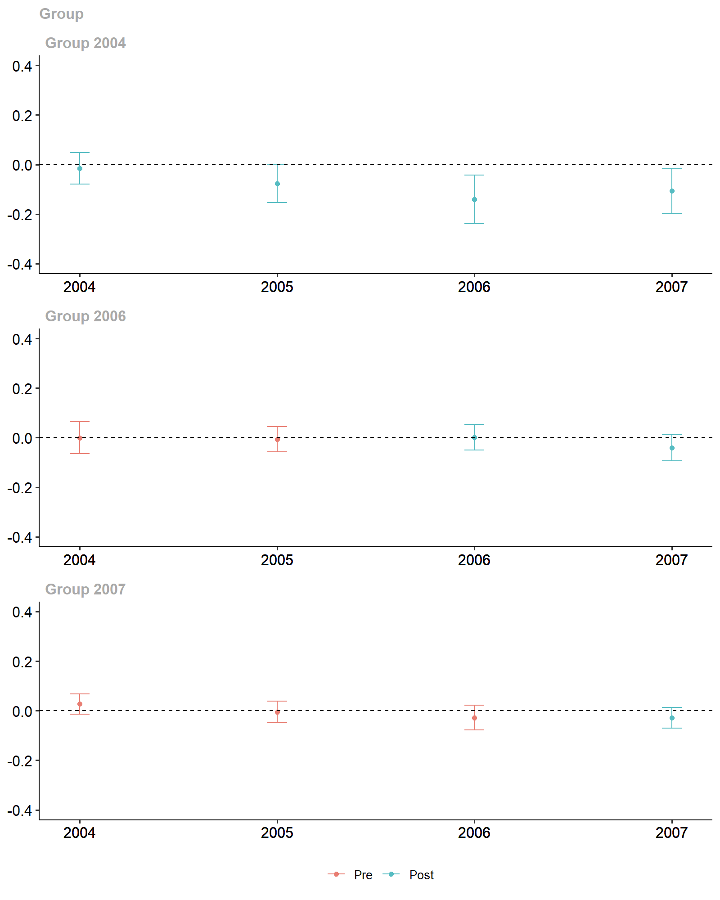
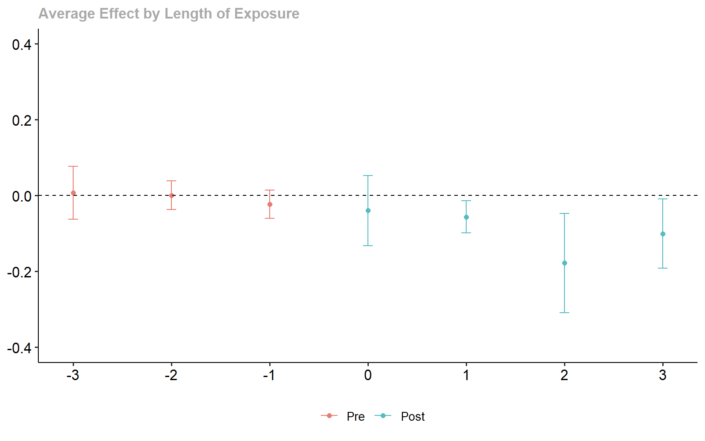

# Introduction

This article illustrates how ``ddml`` can complement the highly popular [``did``](https://bcallaway11.github.io/did/index.html) package to compute group-time average treatment effects under a _conditional_ parallel trends assumption. The result is a doubly-robust difference-in-difference estimator for staggered treatment adoption designs that leverages machine learning and (short-)stacking to flexibly control for covariates.

For an excellent introduction to differences-in-differences with multiple time periods, see also [this article](https://bcallaway11.github.io/did/articles/multi-period-did.html).


# Estimation using ``did``'s Default Estimator

For illustration, consider the data of Callaway and Sant'Anna (2020) on county-level teen employment rates from 2003-2007 for additional details. We are interested in the effect of treatment on the log-employment rate ``lemp`` and assume that parallel trends holds conditional on county population (``lpop`` is the log of county population).


```r
# Load the did package
library(did)
set.seed(588239)

# Print the data
data(mpdta)
head(mpdta)
#>     year countyreal     lpop     lemp first.treat treat
#> 866 2003       8001 5.896761 8.461469        2007     1
#> 841 2004       8001 5.896761 8.336870        2007     1
#> 842 2005       8001 5.896761 8.340217        2007     1
#> 819 2006       8001 5.896761 8.378161        2007     1
#> 827 2007       8001 5.896761 8.487352        2007     1
#> 937 2003       8019 2.232377 4.997212        2007     1
```

By default, the group-time average treatment effect estimator of the ``did`` package controls _linearly_ for additional covariates. (In particular, the propensity score is estimated using [logistic regression](https://github.com/pedrohcgs/DRDID/blob/master/R/drdid_panel.R#L96) and the outcome reduced form is estimated via  [linear regression](https://github.com/pedrohcgs/DRDID/blob/master/R/drdid_panel.R#L107)). The below code snippet runs the default linear specification (similar to [this article](https://bcallaway11.github.io/did/articles/did-basics.html#an-example-with-real-data)).


```r
# Estimate group-time average treatment effects with covariates
attgt_lm <- att_gt(yname = "lemp",
                   gname = "first.treat",
                   idname = "countyreal",
                   tname = "year",
                   xformla = ~lpop,
                   data = mpdta)

# summarize the results
summary(attgt_lm)
#> 
#> Call:
#> att_gt(yname = "lemp", tname = "year", idname = "countyreal", 
#>     gname = "first.treat", xformla = ~lpop, data = mpdta)
#> 
#> Reference: Callaway, Brantly and Pedro H.C. Sant'Anna.  "Difference-in-Differences with Multiple Time Periods." Journal of Econometrics, Vol. 225, No. 2, pp. 200-230, 2021. <https://doi.org/10.1016/j.jeconom.2020.12.001>, <https://arxiv.org/abs/1803.09015> 
#> 
#> Group-Time Average Treatment Effects:
#>  Group Time ATT(g,t) Std. Error [95% Simult.  Conf. Band]  
#>   2004 2004  -0.0145     0.0228       -0.0783      0.0492  
#>   2004 2005  -0.0764     0.0275       -0.1532      0.0004  
#>   2004 2006  -0.1404     0.0350       -0.2381     -0.0428 *
#>   2004 2007  -0.1069     0.0325       -0.1976     -0.0162 *
#>   2006 2004  -0.0005     0.0232       -0.0652      0.0643  
#>   2006 2005  -0.0062     0.0181       -0.0567      0.0443  
#>   2006 2006   0.0010     0.0186       -0.0508      0.0527  
#>   2006 2007  -0.0413     0.0187       -0.0935      0.0109  
#>   2007 2004   0.0267     0.0149       -0.0148      0.0683  
#>   2007 2005  -0.0046     0.0155       -0.0479      0.0388  
#>   2007 2006  -0.0284     0.0179       -0.0785      0.0216  
#>   2007 2007  -0.0288     0.0152       -0.0713      0.0137  
#> ---
#> Signif. codes: `*' confidence band does not cover 0
#> 
#> P-value for pre-test of parallel trends assumption:  0.23267
#> Control Group:  Never Treated,  Anticipation Periods:  0
#> Estimation Method:  Doubly Robust
```

The ``did`` package offers visualization methods using ``gglpot2``:


```r
ggdid(attgt_lm, ylim = c(-.4, .4))
```

<div class="figure" style="text-align: center">

<p class="caption">Diff-in-Diff Estimates.</p>
</div>

Further, the group-time average treatment effects can easily be aggregated, for example, to estimate dynamic average treatment effects:


```r
# aggregate the group-time average treatment effects
dyn_lm <- aggte(attgt_lm, type = "dynamic")
summary(dyn_lm)
#> 
#> Call:
#> aggte(MP = attgt_lm, type = "dynamic")
#> 
#> Reference: Callaway, Brantly and Pedro H.C. Sant'Anna.  "Difference-in-Differences with Multiple Time Periods." Journal of Econometrics, Vol. 225, No. 2, pp. 200-230, 2021. <https://doi.org/10.1016/j.jeconom.2020.12.001>, <https://arxiv.org/abs/1803.09015> 
#> 
#> 
#> Overall summary of ATT's based on event-study/dynamic aggregation:  
#>      ATT    Std. Error     [ 95%  Conf. Int.]  
#>  -0.0804        0.0192     -0.118     -0.0427 *
#> 
#> 
#> Dynamic Effects:
#>  Event time Estimate Std. Error [95% Simult.  Conf. Band]  
#>          -3   0.0267     0.0122       -0.0047      0.0582  
#>          -2  -0.0036     0.0128       -0.0366      0.0293  
#>          -1  -0.0232     0.0157       -0.0637      0.0172  
#>           0  -0.0211     0.0119       -0.0519      0.0098  
#>           1  -0.0530     0.0164       -0.0953     -0.0107 *
#>           2  -0.1404     0.0379       -0.2382     -0.0427 *
#>           3  -0.1069     0.0323       -0.1903     -0.0235 *
#> ---
#> Signif. codes: `*' confidence band does not cover 0
#> 
#> Control Group:  Never Treated,  Anticipation Periods:  0
#> Estimation Method:  Doubly Robust
ggdid(dyn_lm, ylim = c(-.4, .4))
```

<div class="figure" style="text-align: center">

<p class="caption">Dynamic Treatment Effect Estimates.</p>
</div>


# Contructing a ``xgboost``-based Diff-in-Diff Estimator

Without additional _parametric_ functional form assumptions on the reduced form equations, it is _not_ guaranteed that the default ``att_gt`` estimator returns a convex combination of causal effects. This is because linear predictors do not necessarily correspond to the conditional expectation functions arising in the doubly-robust score of the group-time average treatment effect. The resulting misspecification error can then lead to negative weights in the aggregation of individual-level treatment effects.

Fortunately, a convex combination of causal effects can be guaranteed (without parametric functional form assumptions) when using machine learning (nonparametric) reduced for estimators.

The ``ddml`` package facilitates the use of a large set of machine learning reduced form estimators, including simultaneous considerations of multiple estimators via (short-)stacking.

To use ``ddml`` estimators with the ``did`` package, we can make use of the ``est_method`` argument of the ``att_gt`` function (see also ``?att_gt``). It is useful to construct an estimation method in two steps:

1. A simple wrapper for ``ddml_att`` that returns the objects needed by ``att_gt``
2. A second wrapper that hard-codes arguments passed to ``ddml_att`

This two-step approach allows for cleaner code when considering multiple ddml-based estimators (as we do in this article).

The below code-snippet constructs a simple estimation method following step 1:

```r
# load the ddml package
library(ddml)

# write a general wrapper for ddml_att
ddml_did_method <- function(y1, y0, D, covariates, ...) {
  # Compute difference in outcomes
  delta_y <- y1 - y0
  # Compute the ATT
  att_fit <- ddml_att(y = delta_y, D = D, X = covariates, ...)
  # Return results
  inf.func <- att_fit$psi_b + att_fit$att * att_fit$psi_a
  output <- list(ATT = att_fit$att, att.inf.func = inf.func)
  return(output)
}#DDML_DID_METHOD
```

A potentially suitable machine learning reduced form estimator is gradient tree boosting (see also ``?mdl_xgboost``). The below code snippet completes the second wrapper by hard-coding both the learner and its arguments. Here, we consider 10-fold cross-fitting with a heavily regularized gradient tree bosting estimator (``eta`` is the learning rate, see also ``?mdl_xgboost``).


```r
my_did_xgboost <- function(y1, y0, D, covariates, ...) {
  # Hard-code learners
  learners = list(what = mdl_xgboost,
                  args = list(nround = 500,
                              params = list(eta = 0.05, max_depth = 1),
                              early_stopping_rounds = 1))
  learners_DX = learners

  # Call the general ddml_did method w/ additional hard-coded arguments
  ddml_did_method(y1, y0, D, covariates,
                  learners = learners,
                  learners_DX = learners_DX,
                  sample_folds = 10,
                  silent = TRUE)
}#MY_DID_DDML
```

We can now use the reduced form estimator ``my_did_xgboost`` and pass it via the ``est_method`` argument:


```r
# estimate group-time average treatment effects with ddml
attgt_xgboost <- att_gt(yname = "lemp",
                        gname = "first.treat",
                        idname = "countyreal",
                        tname = "year",
                        xformla = ~lpop,
                        data = mpdta,
                        est_method = my_did_xgboost)

# summarize the results
summary(attgt_xgboost)
#> 
#> Call:
#> att_gt(yname = "lemp", tname = "year", idname = "countyreal", 
#>     gname = "first.treat", xformla = ~lpop, data = mpdta, est_method = my_did_xgboost)
#> 
#> Reference: Callaway, Brantly and Pedro H.C. Sant'Anna.  "Difference-in-Differences with Multiple Time Periods." Journal of Econometrics, Vol. 225, No. 2, pp. 200-230, 2021. <https://doi.org/10.1016/j.jeconom.2020.12.001>, <https://arxiv.org/abs/1803.09015> 
#> 
#> Group-Time Average Treatment Effects:
#>  Group Time ATT(g,t) Std. Error [95% Simult.  Conf. Band]  
#>   2004 2004  -0.0184     0.0249       -0.0836      0.0467  
#>   2004 2005  -0.0791     0.0322       -0.1634      0.0051  
#>   2004 2006  -0.1779     0.0519       -0.3136     -0.0422 *
#>   2004 2007  -0.1005     0.0389       -0.2024      0.0014  
#>   2006 2004  -0.0038     0.0228       -0.0635      0.0559  
#>   2006 2005  -0.0022     0.0165       -0.0454      0.0410  
#>   2006 2006   0.0014     0.0255       -0.0653      0.0682  
#>   2006 2007  -0.0451     0.0218       -0.1021      0.0119  
#>   2007 2004   0.0072     0.0306       -0.0729      0.0873  
#>   2007 2005   0.0019     0.0204       -0.0516      0.0554  
#>   2007 2006  -0.0294     0.0195       -0.0806      0.0217  
#>   2007 2007  -0.0557     0.0553       -0.2003      0.0889  
#> ---
#> Signif. codes: `*' confidence band does not cover 0
#> 
#> P-value for pre-test of parallel trends assumption:  0.78716
#> Control Group:  Never Treated,  Anticipation Periods:  0

# plot the coefficients
ggdid(attgt_xgboost, ylim = c(-.4, .4))
```

<div class="figure" style="text-align: center">

<p class="caption">xgboost-based Diff-in-Diff Estimates.</p>
</div>

Of course, use of the ``ddml``-based reduced form estimator still allows us to leverage the various other methods of the ``did`` package, including the construction (and visualization of) dynamic average treatment effects:


```r
# aggregate the group-time average treatment effects
dyn_xgboost <- aggte(attgt_xgboost, type = "dynamic")
summary(dyn_xgboost)
#> 
#> Call:
#> aggte(MP = attgt_xgboost, type = "dynamic")
#> 
#> Reference: Callaway, Brantly and Pedro H.C. Sant'Anna.  "Difference-in-Differences with Multiple Time Periods." Journal of Econometrics, Vol. 225, No. 2, pp. 200-230, 2021. <https://doi.org/10.1016/j.jeconom.2020.12.001>, <https://arxiv.org/abs/1803.09015> 
#> 
#> 
#> Overall summary of ATT's based on event-study/dynamic aggregation:  
#>      ATT    Std. Error     [ 95%  Conf. Int.]  
#>  -0.0937        0.0223    -0.1374       -0.05 *
#> 
#> 
#> Dynamic Effects:
#>  Event time Estimate Std. Error [95% Simult.  Conf. Band]  
#>          -3   0.0072     0.0295       -0.0627      0.0772  
#>          -2   0.0006     0.0161       -0.0376      0.0388  
#>          -1  -0.0231     0.0159       -0.0606      0.0145  
#>           0  -0.0398     0.0388       -0.1319      0.0522  
#>           1  -0.0565     0.0179       -0.0988     -0.0141 *
#>           2  -0.1779     0.0553       -0.3089     -0.0470 *
#>           3  -0.1005     0.0386       -0.1919     -0.0090 *
#> ---
#> Signif. codes: `*' confidence band does not cover 0
#> 
#> Control Group:  Never Treated,  Anticipation Periods:  0
ggdid(dyn_xgboost, ylim = c(-.4, .4))
```

<div class="figure" style="text-align: center">

<p class="caption">xgboost-based Dynamic Treatment Effect Estimates.</p>
</div>

The gradient tree boosting-based ATT estimate of about -0.094 is slightly larger than the ATT estimate of about -0.08 of the linear estimator of the ``did`` package.

Given these two coefficients, is there a good reason to choose one over the other?

It is ex-ante difficult to trade-off the potential bias from misspecification that the linear estimator suffers from with the potential bias from estimation error that the gradient tree boosting estimator may suffer from. ``ddml`` allows to resolve this conflict in a data-driven manner by simultaneousconsideration of multiple machine learners via (short-)stacking. We turn to this in the next section.

# Contructing a Shortstacking-based Diff-in-Diff Estimator

Instead of considering just a single machine learner -- that may or may not be suitable for the given application -- we can leverage the (short-)stacking and simultaneously consider multiple machine learners. As in other settings, this substantially increases robustness to the underlying structure of the data.

To ensure that machine learners are not spuriously selected, we include the linear control specifications considered by the default ``did`` learner as well. The code snippet below constructs the logistic regression reduced form estimator:


```r
# Write glm wrapper
mdl_glm <- function(y, X, ...) {
  df <- data.frame(y, X) # transform data from matrices to data.frame
  glm_fit <- glm(y ~ ., data = df, ...) # fit glm
  class(glm_fit) <- c("mdl_glm", class(glm_fit)) # append class
  return(glm_fit) # return fitted glm object
}#MDL_GLM

# Write predict.glm wrapper
predict.mdl_glm <- function(object, newdata) {
  df <- data.frame(newdata) # transform data from matrices to data.frame
  predict.glm(object, df, type = "response")
}#PREDICT.MDL_GLM
```

Then, we construct a new wrapper for our ``ddml_did_method`` that hard-codes different reduced form estimators:

- linear or logistic regression
- gradient tree boosting with more and less regularization
- random forests with more and less regularization

The reduced form estimators are then optimally combined via non-negative least squares. We leverage shortstacking to reduce computational time (see also ``vignette(stacking)``).


```r
my_did_stacking <- function(y1, y0, D, covariates, ...) {
  # Hard-code learners for outcome reduced-form
  learners = list(list(fun = ols),
                  list(fun = mdl_xgboost,
                       args = list(nround = 500,
                                   params = list(eta = 0.05, max_depth = 1),
                                   early_stopping_rounds = 1)),
                  list(fun = mdl_xgboost,
                       args = list(nround = 500,
                                   params = list(eta = 0.1, max_depth = 3),
                                   early_stopping_rounds = 1)),
                  list(fun = mdl_ranger,
                       args = list(num.trees = 1000,
                                   max.depth = 1)),
                  list(fun = mdl_ranger,
                       args = list(num.trees = 1000,
                                   max.depth = 20)))
  # Hard-code learners for treatment reduced-form
  learners_DX = list(list(fun = mdl_glm),
                  list(fun = mdl_xgboost,
                       args = list(nround = 500,
                                   params = list(eta = 0.05, max_depth = 1),
                                   early_stopping_rounds = 1)),
                  list(fun = mdl_xgboost,
                       args = list(nround = 500,
                                   params = list(eta = 0.05, max_depth = 3),
                                   early_stopping_rounds = 1)),
                  list(fun = mdl_ranger,
                       args = list(num.trees = 1000,
                                   max.depth = 1)),
                  list(fun = mdl_ranger,
                       args = list(num.trees = 1000,
                                   max.depth = 20)))
  # Call the general ddml_did method w/ additional hard-coded arguments
  ddml_did_method(y1, y0, D, covariates,
                  learners = learners,
                  learners_DX = learners_DX,
                  sample_folds = 10,
                  ensemble_type = "nnls",
                  shortstack = TRUE,
                  silent = TRUE)
}#MY_DID_DDML
```

Finally, we recompute the group-time average treatment effects using our shortstacking estimator:


```r
# estimate group-time average treatment effects with ddml
attgt_stacking <- att_gt(yname = "lemp",
                         gname = "first.treat",
                         idname = "countyreal",
                         tname = "year",
                         xformla = ~lpop ,
                         data = mpdta,
                         est_method = my_did_stacking)

# summarize the results
summary(attgt_stacking)
#> 
#> Call:
#> att_gt(yname = "lemp", tname = "year", idname = "countyreal", 
#>     gname = "first.treat", xformla = ~lpop, data = mpdta, est_method = my_did_stacking)
#> 
#> Reference: Callaway, Brantly and Pedro H.C. Sant'Anna.  "Difference-in-Differences with Multiple Time Periods." Journal of Econometrics, Vol. 225, No. 2, pp. 200-230, 2021. <https://doi.org/10.1016/j.jeconom.2020.12.001>, <https://arxiv.org/abs/1803.09015> 
#> 
#> Group-Time Average Treatment Effects:
#>  Group Time ATT(g,t) Std. Error [95% Simult.  Conf. Band]  
#>   2004 2004  -0.0083     0.0219       -0.0648      0.0482  
#>   2004 2005  -0.0781     0.0312       -0.1586      0.0024  
#>   2004 2006  -0.1408     0.0404       -0.2450     -0.0365 *
#>   2004 2007  -0.1085     0.0355       -0.2003     -0.0168 *
#>   2006 2004  -0.0047     0.0231       -0.0643      0.0548  
#>   2006 2005  -0.0067     0.0195       -0.0570      0.0436  
#>   2006 2006   0.0010     0.0204       -0.0517      0.0537  
#>   2006 2007  -0.0417     0.0195       -0.0922      0.0088  
#>   2007 2004   0.0275     0.0143       -0.0095      0.0645  
#>   2007 2005  -0.0028     0.0174       -0.0478      0.0421  
#>   2007 2006  -0.0288     0.0182       -0.0757      0.0182  
#>   2007 2007  -0.0284     0.0167       -0.0716      0.0149  
#> ---
#> Signif. codes: `*' confidence band does not cover 0
#> 
#> P-value for pre-test of parallel trends assumption:  0.19468
#> Control Group:  Never Treated,  Anticipation Periods:  0

# plot the coefficients
ggdid(attgt_stacking, ylim = c(-.4, .4))
```

<div class="figure" style="text-align: center">

<p class="caption">Stacking-based Diff-in-Diff Estimates.</p>
</div>
The results are largely similar to those of the default linear estimator of the ``did`` package, suggesting that the linear approximation of the reduced forms is sufficiently accurate. (Of course we didn't know that before -- now, at least, we can sleep easy!)

Other settings, in particular settings with multiple control variables, may show starker difference in the final estimates.


```r
# aggregate the group-time average treatment effects
dyn_stacking <- aggte(attgt_stacking, type = "dynamic")
summary(dyn_stacking)
#> 
#> Call:
#> aggte(MP = attgt_stacking, type = "dynamic")
#> 
#> Reference: Callaway, Brantly and Pedro H.C. Sant'Anna.  "Difference-in-Differences with Multiple Time Periods." Journal of Econometrics, Vol. 225, No. 2, pp. 200-230, 2021. <https://doi.org/10.1016/j.jeconom.2020.12.001>, <https://arxiv.org/abs/1803.09015> 
#> 
#> 
#> Overall summary of ATT's based on event-study/dynamic aggregation:  
#>      ATT    Std. Error     [ 95%  Conf. Int.]  
#>  -0.0808          0.02    -0.1199     -0.0417 *
#> 
#> 
#> Dynamic Effects:
#>  Event time Estimate Std. Error [95% Simult.  Conf. Band]  
#>          -3   0.0275     0.0137       -0.0073      0.0624  
#>          -2  -0.0033     0.0128       -0.0358      0.0292  
#>          -1  -0.0236     0.0154       -0.0628      0.0156  
#>           0  -0.0201     0.0118       -0.0500      0.0098  
#>           1  -0.0539     0.0169       -0.0967     -0.0110 *
#>           2  -0.1408     0.0381       -0.2374     -0.0441 *
#>           3  -0.1085     0.0333       -0.1932     -0.0238 *
#> ---
#> Signif. codes: `*' confidence band does not cover 0
#> 
#> Control Group:  Never Treated,  Anticipation Periods:  0
ggdid(dyn_stacking, ylim = c(-.4, .4))
```

<div class="figure" style="text-align: center">

<p class="caption">Stacking-based Dynamic Treatment Effect Estimates.</p>
</div>


# References

Callaway B, Sant'Anna P (2021). “Difference-in-differences with multiple time periods.” Journal of Econometrics, 200-230.

Callaway B, Sant'Anna P (2021). “did: Difference in Differences.” R package version 2.1.2, https://bcallaway11.github.io/did/.

